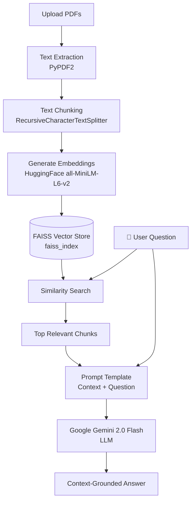

#  AI PDF Chatbot with RAG

An intelligent multi-PDF Question & Answering chatbot built with **Streamlit**, **LangChain**, **FAISS**, and **Google Gemini**.

Upload one or multiple PDF files, ask natural language questions, and get accurate, context-grounded answers powered by Retrieval-Augmented Generation (RAG).

 **Live Demo:** [AI PDF Chatbot on Streamlit](https://ai-pdf-chatbot-with-rag-gaiwgvphjfh8uduubzw65l.streamlit.app/)

---


<a href="https://ibb.co/xKnLDrHL"></a>

##  Architecture & How It Works



1. **Extraction**: `PyPDF2` reads all pages across all uploaded PDF documents and compiles raw text.
2. **Chunking**: LangChain's `RecursiveCharacterTextSplitter` breaks the text into manageable chunks with overlap to retain context across boundaries.
3. **Embedding & Storage**: Hugging Face sentence transformers convert chunks into 384-dimensional dense vectors stored in a local **FAISS** index.
4. **Retrieval**: When a question is asked, FAISS executes a similarity search to find the most relevant chunks.
5. **Generation**: The retrieved context chunks and the user's question are passed to **Google Gemini** to formulate a detailed, factually grounded answer.

---

##  Tech Stack

- **Frontend / Framework:** [Streamlit](https://streamlit.io/)
- **RAG Orchestration:** [LangChain](https://www.langchain.com/)
- **PDF Extraction:** [PyPDF2](https://pypdf2.readthedocs.io/)
- **Embedding Model:** [Hugging Face sentence-transformers/all-MiniLM-L6-v2](https://huggingface.co/sentence-transformers/all-MiniLM-L6-v2)
- **Vector Database:** [FAISS (Facebook AI Similarity Search)](https://github.com/facebookresearch/faiss)
- **Large Language Model:** [Google Gemini 2.0 Flash](https://ai.google.dev/)

---

##  Project Structure

```text
├── app.py              # Main Streamlit web application & RAG pipeline
├── requirements.txt    # Python package dependencies
├── README.md           # Project documentation
└── .gitignore          # Files and folders to ignore in Git
```

---

##  Installation & Local Setup

### 1. Clone the Repository
```bash
git clone https://github.com/Decodeme007/AI-PDF-Chatbot-with-RAG.git
cd AI-PDF-Chatbot-with-RAG
```

### 2. Create and Activate a Virtual Environment

**On Windows:**
```bash
python -m venv myenv
myenv\Scripts\activate
```

**On macOS / Linux:**
```bash
python3 -m venv myenv
source myenv/bin/activate
```

### 3. Install Dependencies
```bash
pip install -r requirements.txt
```

### 4. Get a Google Gemini API Key
- Head over to [Google AI Studio](https://aistudio.google.com/) to generate a free API key.
- You will input this key directly into the application's sidebar.

---

##  Running the Application

Launch the Streamlit app:
```bash
streamlit run app.py
```

1. Open your browser at `http://localhost:8501`.
2. In the sidebar, paste your **Google API Key**.
3. Upload one or more **PDF files** and click **Submit & Process**.
4. Ask questions in the chat box and receive answers based on your documents!

---

